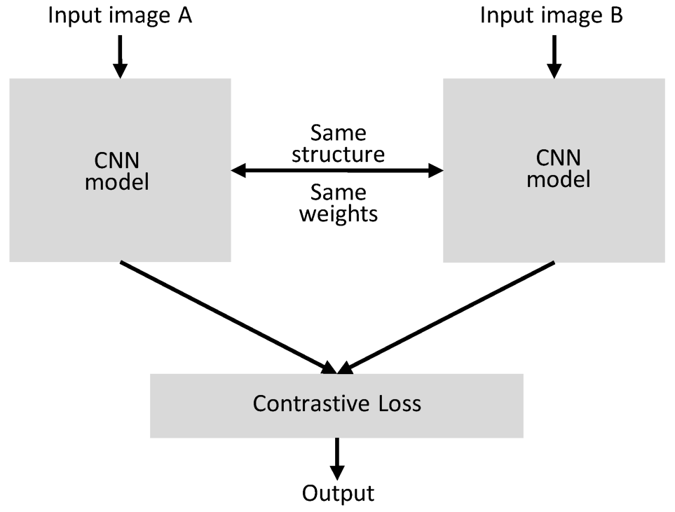
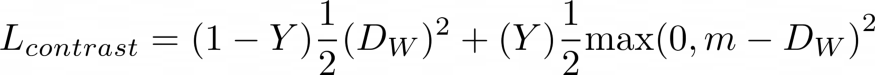
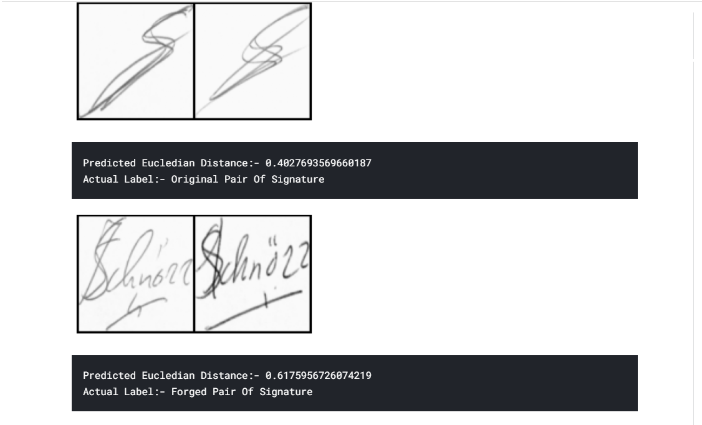

# Signature-Classification-using-Siamese-Network

A model that classifies the forged and original pairs of signatures by calculating the eucledian Distance between the output tensors of both the images using a Siamese Network.

## Siamese Network

Siamese neural network is an artificial neural network that use the same weights while working in tandem on two different input vectors to compute comparable output vectors. Often one of the output vectors is precomputed, thus forming a baseline against which the other output vector is compared. 

This is similar to comparing fingerprints or more technical as a distance function for Locality-sensitive hashing.

In Siamese network we keep the basic network for getting features of entities(images/text) same and pass the two entities we want to compare through the exact same network. By the exact same network it is meant that both the entities are passed through the same architecture having same weights as shown in the figure. 

At the end of common network we get a vectored representation of our input which can then be used for measuring or quantifying the similarity between them.
<br>
  
<br>

## Contrastive Loss

Contrastive loss is widely-used in unsupervised and self-supervised learning. Originally developed by Hadsell et al. in 2016 from Yann LeCun’s group, this loss function operates on pairs of samples instead of individual samples. It defines a binary indicator Y for each pair of samples stating whether they should be deemed similar, and a learnable distance function D_W(x_1, x_2) between a pair of samples x_1, x_2, parameterized by the weights W in the neural network.

, where m>0 is a margin. The margin defines a radius around the embedding space of a sample so that dissimilar pairs of samples only contribute to the contrastive loss function if the distance D_W is within the margin.

Intuitively, this loss function encourages the neural network to learn a embedding to place samples with the same labels close to each other, while distancing the samples with different labels in the embedding space
<br>
  
<br>


## Dataset Used

Dataset can be found here[https://www.kaggle.com/robinreni/signature-verification-dataset]


## Technologies Used
```
1. Pytorch

2. Siamese Network

3. CNN

4. Contrastive Loss
```

## Sample Output

<br>
  
<br>

## Author
```
Rahul Kumar Patro
```

